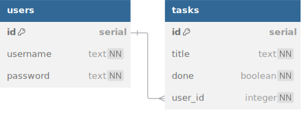

# Task List

This backend allows users to manage their workload. After making an account,
a user will be able to create, read, update, and delete their tasks.

## Database



<details>
<summary>See DBML</summary>

```dbml
table users {
  id serial [pk]
  username text [unique, not null]
  password text [not null]
}

table tasks {
  id serial [pk]
  title text [not null]
  done boolean [default: false, not null]
  user_id integer [not null]
}

Ref: users.id < tasks.user_id [delete: cascade]
```

</details>

1. Create a new Postgres database named `tasklist`.
2. Create tables in `schema.sql` according to the schema above.
3. Seed the database with at least 1 user owning at least 3 tasks.

## API

Once your database is properly seeded, build an Express app that serves the following routes.

The 🔒lock icon next to a route indicates that it must be a protected route.
A user can only access that route by attaching a valid token to their request.
If a valid token is not provided, immediately send a 401 Unauthorized error.

`/users` router

- `POST /users/register`
  - sends 400 if request body is missing username or password
  - creates a new user with the provided credentials and sends a token
  - the password should be hashed in the database
- `POST /users/login`
  - sends 400 if request body is missing username or password
  - sends a token if the provided credentials are valid

`/tasks` router

- 🔒`POST /tasks` creates a new task owned by the logged-in user
  - sends 400 if request body does not include `title` and `done`
- 🔒`GET /tasks` sends array of all tasks owned by the logged-in user
- 🔒`PUT /tasks/:id` updates the specific task owned by the logged-in user
  - sends 400 if request body does not include `title` and `done`
  - sends 403 Forbidden if user does not own this task
- 🔒`DELETE /tasks/:id` deletes the specific task owned by the logged-in user
  - sends 403 Forbidden if user does not own this task
